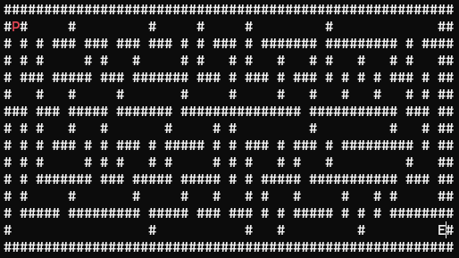

# Maze CLI Game

A terminal-based maze game written in Rust — **manually, by hand, without AI generation**.

## Why?

This project exists as a deliberate exercise in the age of AI-generated code. Every line was typed manually, every bug was debugged the old-fashioned way. The goal is to learn Rust by actually writing it — dealing with the borrow checker, ownership, traits, and all the rough edges that come with a new language — not by having a model write it for you.

## What it does

Generates a random maze and lets you navigate through it in the terminal. Find the exit marked `E` and reach it to win.



## Controls

| Key         | Action        |
|-------------|---------------|
| Arrow keys  | Move player   |
| `q`         | Quit          |

## Legend

| Symbol | Meaning      |
|--------|--------------|
| `P`    | Player       |
| `E`    | Exit         |
| `W`    | You won!     |
| `#`    | Wall         |

## How it works

- The maze is procedurally generated using a **recursive backtracker** (depth-first search with a stack)
- The map is stored as a `HashMap<(u16, u16), CellType>` — each cell is either a `Wall` or `Empty`
- Rendering is done with [crossterm](https://github.com/crossterm-rs/crossterm) for cross-platform raw terminal control
- Player movement checks the map before updating position — walls block movement

## Tech stack

- **Rust** (edition 2024)
- [`crossterm`](https://crates.io/crates/crossterm) — terminal rendering and keyboard input
- [`rand`](https://crates.io/crates/rand) — random number generation

## Running

```sh
cargo run
```
